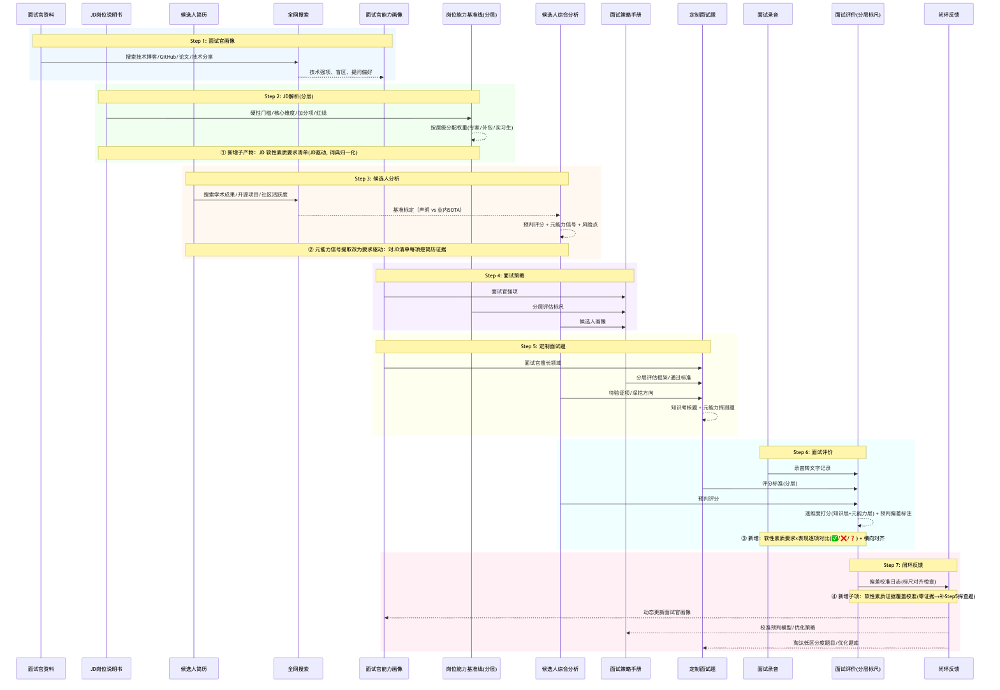

# interview-loop

> 一套自进化的面试辅助 skill：**降低面试官准备成本、提升评估准确度**，通过闭环反馈让每次面试都比上一次更好。

[](./LICENSE)
[](https://github.com/Beants/interview-loop/actions/workflows/pii-scan.yml)
[](./docs/install.md)

*An open-source agent skill for technical interviews: a 7-step pipeline from interviewer profiling to closed-loop feedback. Every interview becomes calibration data for the next one — and all sample data is fictional, so you can try it end-to-end without any private information.*

**目录：** [这是什么](#这是什么) · [核心能力](#核心能力) · [7 步流水线](#7-步流水线) · [快速开始](#快速开始) · [使用建议](#使用建议) · [目录结构](#目录结构) · [隐私边界](#隐私边界) · [贡献](#贡献) · [许可证](#许可证)

---

## 这是什么

`interview-loop` 是一个自包含的 **agent skill bundle**（`skill/SKILL.md` + 9 个参考示例），提供一条完整的面试流水线：面试官画像 → JD 解析 → 候选人分析 → 面试策略 → 定制面试题 → 面试评价 → 闭环反馈。

把它放进任意支持 `SKILL.md` 的 agent runtime，你的 agent 就获得了这套方法论：

- **激活名** `interview-loop` 由 `skill/SKILL.md` 的 frontmatter `name` 决定，与仓库名 / 目录名解耦
- **对数据位置无感**：skill 只用相对路径，输入由调用方在运行时提供，输出写到当前工作目录的 `面试分析/`

## 核心能力

均支持缺资料退化（无简历 / 无面试记录 / JD 缺失 / 单人 / 海量人时降级产出 + 显式标注缺口，不臆测）：

- **探底 + 元能力**：面试不是"知识点考试"，而是"通过交互探真实水位 + 观察元能力反应"。"不会"是中性的，关键看"不会"之后的反应（诚实承认 → 加分；编造 → 强减分）。
- **分层标尺（SoT）**：专家 / 外包 / 实习生岗使用不同的权重、通过线、红线，禁止跨层级直接对比分数。标尺表是全局唯一配置源，各处派生自它。
- **软性素质三段闭环**：Step 2 JD 驱动挖要求清单 → Step 3 要求驱动挖简历证据 → Step 6 要求 × 表现逐项对比（✅ 有证据 / ❌ 缺失 / ❓ 存疑），JD 是唯一要求标尺。
- **联网搜索验证**：所有分析必须经联网搜索验证，搜不到的标注"无法验证"，不作为判断依据，不臆测。

## 7 步流水线



| Step | 做什么 | 核心产物 |
|------|--------|---------|
| 1 | 面试官画像 | 技术强项、盲区、提问偏好（全网搜索） |
| 2 | JD 解析（分层标尺） | 岗位能力基准线 + 软性素质要求清单 |
| 3 | 候选人分析 | 简历拆解 + 联网验证 + 元能力信号 + 预判评分 |
| 4 | 面试策略 | 策略手册（评价哲学 + 分层权重 + 通过线 + 红线） |
| 5 | 定制面试题 | 知识考核题 + 元能力探测题 + 缺口定向探查 |
| 6 | 面试评价 | 逐维度评分 + 要求×表现对比 + 预判偏差标注 |
| 7 | 闭环反馈 | 偏差校准 → 反哺画像 / 策略 / 题库 |

方法论全文与各步骤详解见 [`skill/SKILL.md`](./skill/SKILL.md)。

## 快速开始

```bash
git clone https://github.com/Beants/interview-loop.git
cd interview-loop
```

**1. 安装 skill**（复制 `skill/` 到你的 agent runtime 的 skills 目录）：

| Runtime | 安装命令 |
|---------|---------|
| Claude Code | `cp -R skill ~/.claude/skills/interview-loop` |
| Hermes | `cp -R skill ~/.hermes/skills/interview-loop` |
| OpenCode | `cp -R skill ~/.config/opencode/skills/interview-loop` |
| 其他 | 复制 `skill/` 到对应 skills 目录即可（或 `ln -s "$(pwd)/skill" <skills目录>/interview-loop` 软链，随仓库更新） |

详细安装 / 卸载步骤见 [`docs/install.md`](./docs/install.md)。

**2. 验证安装**：在你的 agent 里描述一个面试准备场景，例如

> 我要面试一位候选人，请帮我做岗位能力基准线解析。

**3. 用虚构示例试跑**（无需任何真实数据，clone 即跑）：`examples/` 提供一份完全虚构的 JD / 简历 / 面试记录（候选人「林沐」应聘虚构公司「星澜科技」的「后端架构师 / AI 工程化专家」岗），喂给加载了 skill 的 agent 即可：

- 做 Step 2（JD 解析）→ 喂 `examples/jd/后端架构AI工程化-示例JD.md`
- 做 Step 3（候选人分析）→ 喂 JD + `examples/resume/林沐-简历-示例.md`
- 做 Step 6（面试评价）→ 再补 `examples/transcript/林沐-面试记录-示例.txt`

## 使用建议

- **一次面试一个文件夹**：为每次面试新建独立目录，把该次的 JD / 简历 / 面试记录 / 分析产物都放进这个"面试项目"里再调用 skill。输出写在当前工作目录的 `面试分析/` 下，一次面试一个文件夹，互不污染、事后好回看。
- **按完整流程走，效果最好**：推荐从 Step 1 面试官画像开始，先生成连贯画像，再依次往下走（Step 2 → 7）。单步入口也能用（见上方 7 步流水线表），但完整流程才能吃到闭环反馈的红利——这本来就是"越用越好用"的设计。
- **打开联网权限**：Step 1 / 3 依赖联网搜索做验证（技术博客、GitHub、论文、公开数据基准标定）。不联网时，所有搜索验证项会降级为"无法验证"，评估准确度会打折。

## 目录结构

```
interview-loop/
├── skill/                  # skill 本体（开源核心，可整体复制到 skills 目录）
│   ├── SKILL.md            # 方法论全文（7 步流水线 + 评价哲学 + 分层标尺）
│   └── references/         # 9 个流水线输出格式示例（全部虚构，含软性素质对比 + 词典）
├── examples/               # 虚构示例数据（clone 即跑：jd/ resume/ transcript/）
├── data/                   # 私有数据唯一落点（内容被 gitignore，仅留占位）
├── scripts/check-pii.sh    # PII 正则扫描（CI 硬门禁）
├── tech-test-cases.md      # 技术侧测试用例（TC-T01 ~ TC-T39，门禁执行器执行）
└── docs/                   # install.md / privacy.md / assets/（含流水线时序图）
```

## 隐私边界

> **`skill/` + `examples/` 公开；`data/` 私有；真实面试数据绝不入库。**

- 仓库中所有示例人物、公司、项目、指标均为**虚构同构数据**，不指向任何真实个人或组织。
- 你自己的真实面试数据**只允许放进 `data/`**（已被 `.gitignore` 覆盖），且 skill 对数据位置无感，不会因为数据在 `data/` 下就行为异常。
- 防泄漏靠三重防护：**目录约定 + `.gitignore` + `scripts/check-pii.sh`（CI 硬门禁）**。提交前运行：

```bash
bash scripts/check-pii.sh
```

如果你发现任何疑似真实信息，欢迎提 issue。详见 [`docs/privacy.md`](./docs/privacy.md)。

## 贡献

欢迎提 issue / PR，请注意：

- **不要提交任何真实候选人 / 面试官数据**。
- 修改 `skill/` 内容时保持相对路径原则（详见 `docs/privacy.md`）。
- PR 会自动跑 PII 扫描，命中真实姓名 / 公司 / 私有路径会被阻断。

## 许可证

[MIT](./LICENSE)
