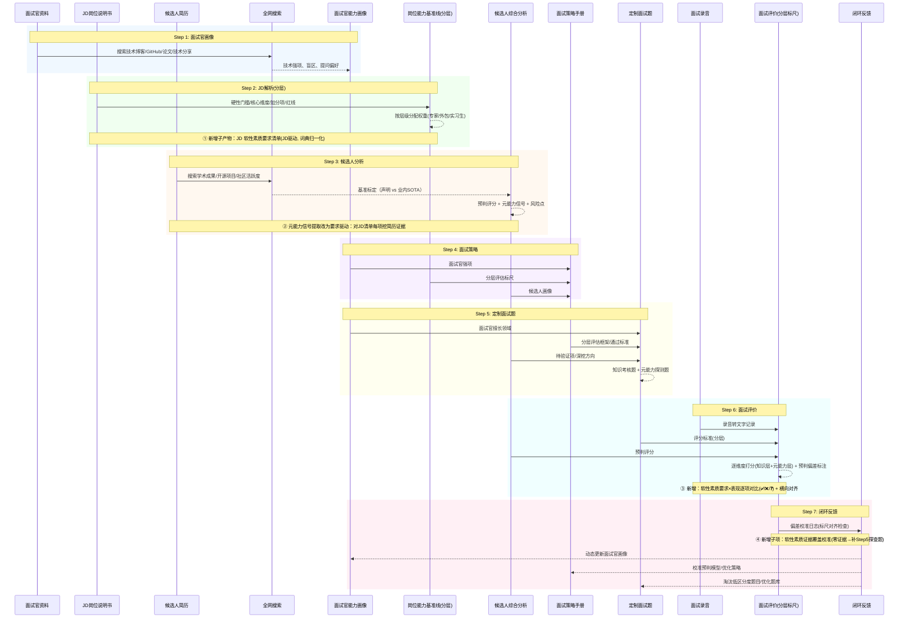

# 面试分析

## 概述

一套自进化的面试辅助流水线，降低面试官准备成本，提升评估准确度，通过闭环反馈让每次面试都比上一次更好。

**三条核心原则（优先级从高到低）：**

1. **探底 + 元能力（最高优先级）**：面试不是"知识点考试"，而是"通过交互探真实水位 + 观察元能力反应"。在 AI 时代，"会不会某个知识点"的重要性大幅下降——知识可查可补，元能力（自知力/态度/可引导性/沟通/诚实度）才是稀缺品。"不会"是中性的，关键看"不会"之后的反应。
2. **分层评价**：不同层级岗位（专家/正式岗、外包/初级岗、实习生岗）用完全不同的评价标尺。权重不同、通过线不同、红线不同。禁止跨层级直接对比分数。
3. **联网搜索验证**：所有分析必须经过联网搜索验证，不接受未验证的声明。搜不到的标注"无法验证"，不作为判断依据，不臆测。

## 速读（TL;DR + 单步入口）

> 全文较长。先看这三层，再按需取用单步，**不必每次从头跑 7 步**。

**三层速读（从核到壳）：**
1. **评价哲学**（下文）— 探底 + 元能力为最高优先级；"不会"是中性的，看元能力反应；分层标尺；软性素质由 JD 驱动挖要求。任何步骤详解与本节冲突时，以本节为准。
2. **分层标尺（SoT）**（下文表）— 专家 / 外包 / 实习生 的权重、通过线、红线全不同；禁止跨层级直接比分数。本表是层级配置的**唯一来源**，各处派生自它。
3. **七步一图**（下文 mermaid）— Step 1 面试官画像 → Step 2 JD 解析（含软性素质要求清单）→ Step 3 候选人分析（要求驱动简历证据）→ Step 4 面试策略 → Step 5 定制面试题（缺口定向探查）→ Step 6 面试评价（要求 × 表现逐项对比）→ Step 7 闭环反哺。

**按需单步入口：**

| 只想干… | 直接读 |
|--------|--------|
| 只评一场面试 | Step 6 面试评价 + Step 3c 要求驱动简历证据 |
| 只做同岗多人横向对比 | Step 6 横向对比 + `references/候选人横向对比-示例.md` |
| 只挖 JD 软性素质要求 | Step 2 软性素质要求挖掘 + `references/软性素质要求×表现对比-示例.md` 第 ① 段 |
| 只出定制面试题 | Step 5 定制面试题 |
| 只校准预判偏差 | Step 7 闭环反馈 |

> 隐私硬约束：真实面试数据绝不入库；对外输出先脱敏（见 `docs/privacy.md`）。

## 适用场景

**适用：**

- 准备面试候选人（任意阶段/任意层级）
- 根据面试录音/文字记录评估候选人
- 构建或更新面试官能力画像
- 生成面试策略或定制面试题
- 校准历史预判与实际面试结果的偏差

**不适用：**

- 纯行为面试、HR 初筛
- 面试过程中的实时辅导

## 退化模式（输入缺失 / 极简场景的行为定义）

> 真实场景常是"资料不全"。流水线在缺资料时**不报错、不臆测、不锁死**，而是**降级产出 + 显式标注缺口**。以下逐项定义退化行为——所有退化都遵守三条硬底线：证据驱动（无原文不下结论，沿用"无法验证 = 中性"）、缺口可见（缺失/未覆盖显式标注、缺口进 Step 5）、分层服从（标尺不因资料缺失而混用）。

| 退化场景 | 触发条件 | 行为定义（机械、可复现） |
|---------|---------|------------------------|
| **无简历** | 只有 JD + 面试记录，无候选人简历 | Step 3 跳过简历拆解；候选人分析仅基于面试证据。软性素质「简历证据」列**全标 ❓未覆盖**（不臆测"有/无"），只采面试证据；预判评分降级为"面试后给出"，不锁分。 |
| **无面试记录** | 只有简历，尚未面试 | Step 6 不执行。只产出 Step 3 预判，**显式标"预判、非定论"**；软性素质只填「简历证据」列，「面试证据 / 综合判定」列**全标 ❓未覆盖**；Step 3 标的 🔴/❓ 缺口直接进 Step 5 探查池。 |
| **JD 极简 / 缺失** | JD 无核心职责 / 任职资格，或压根无 JD | Step 2 软性素质要求清单标「JD 未明确，待确认」，**不臆造要求**；硬性门槛 / 核心维度缺失时主动向需求方确认；层级未明确先按专家岗生成、再按实际候选人补充分层标尺；挖不出要求时，软性素质对比段标注「JD 无可追溯要求，本段留空」而非编造。 |
| **单人** | 同一岗位只有一个候选人 | Step 6 横向对比段**不输出**（无可对齐对象）；只产出单人「要求 × 表现」逐项对比 + 风险点；显式标注「单人无横向参照，结论置信度受限于无对照组」。 |
| **海量人** | 同岗位大量候选人（如校招批量） | 横向对比先按**层级分区**（见 AC-6 两步法），同分区内再按红线 / 高权重要求覆盖度排序 / 聚类，**不两两对比**；输出「层级总览」+ 每层 Top-N 候选人明细，避免表格爆炸。 |

**通用退化原则**：任何"没探到"都归 ❓未覆盖（中性，反哺 Step 5），**禁止把"资料缺失"误判成"候选人没有该素质"**；任何标尺相关判断仍服从「分层标尺（SoT）」，不因资料少而退回统一标尺。

## 评价哲学（第一性原则）

> 本节是面试评价的**最高优先级原则**，优先级高于手册中所有步骤详解。
> 当具体步骤与本节冲突时，以本节为准。
> 本节由实战校准沉淀（候选人E面试偏差校准，2026-06-15）。

### 原则一：不预设信任，靠提问探底

- 简历是自我陈述，天然有包装倾向——这是常态，不是例外
- 面试不是"验证简历真假"，而是**"通过交互，心里有底"**
- 探底 ≠ 抓漏洞。探底的目的是**搞清楚这人能用在哪、怎么用**，不是淘汰
- 每个简历声明默认"待验证"；追问的设计目标是"探到底位"，不是"看他答不上来"
- **探到底之后，水位本身是中性信息**——低水位不等于不通过，取决于元能力

### 原则二："不会"是中性的，关键看元能力反应

"不会"之后的反应，比"会不会"本身重要 10 倍：

| 反应 | 元能力判断 | 评分含义 |
|------|-----------|---------|
| 诚实承认"不会/忘了" | ✅ 自知力 | **加分**——知道自己不会是稀缺品质 |
| 被点破后不狡辩、不编造 | ✅ 态度正 | **加分**——可管理 |
| 给提示后能跟上讨论 | ✅ 可引导 | **加分**——可培养 |
| 能用自己的话复述/延伸 | ✅ 理解力 | **强加分**——真懂了 |
| 编造流程/硬凑答案 | ❌ 不诚实 | **强减分**——诚信问题 |
| 被拆穿后狡辩/甩锅 | ❌ 不可管 | **强减分**——管理灾难 |
| 给提示后仍犟嘴/拒绝思考 | ❌ 不可引导 | **减分**——培养成本高 |
| 答非所问、越解释越乱 | ❌ 沟通障碍 | **减分**——协作成本高 |

### 原则三：AI 时代，沟通能力是第一生产力

AI 能写代码，但 AI 不能替你和上级对齐需求、不能替你跟前后端扯皮、不能替你把复杂的事情讲简单。对外包/执行者岗位，沟通权重应 ≥ 15%。

**沟通四层评估**：L1 能对话（及格）→ L2 思路在（中等）→ L3 能被理解（良好）→ L4 能把复杂讲简单（优秀）。

**减分信号**：答非所问、越解释越乱、需要面试官反复重复问题且无改善。
**中性信号**：表达绕、用词重复——只要思路在、能对话，就是可用的沟通底子。

### 原则四：软性素质——JD 驱动挖要求、跨资料挖证据、逐项对比出缺口

> 元能力五项（自知力/态度-可管理性/可引导性/沟通/诚实度）解决了"怎么评"，但**评什么**应由岗位决定。原则四给元能力评测套一个"角色相关 + 证据可追溯 + 跨人可比"的结构化外壳：以 **JD 为唯一要求标尺**，从中挖掘软性素质要求清单（用 `references/软性素质词典-参考.md` 做同义词归一化），再从简历 + 面试过程资料对每项要求挖证据，最后输出"要求 × 表现"逐项对比（✅有证据支撑 / ❌缺失 / ❓存疑）。

三段闭环，环环可追溯：

```
① JD 软性素质要求挖掘（Step 2）  → "JD 软性素质要求清单"（角色相关、可追溯 JD 原文）
② 跨资料证据挖掘（Step 3 简历 + Step 6 面试） → 对每项要求收集简历证据 + 面试证据（引用原文）
③ 逐项对比（Step 6） → 要求 × 表现对照表：✅有证据支撑 / ❌缺失 / ❓存疑 + 风险点 + 横向对比
④ 反哺（Step 7） → 证据覆盖校准：零证据项 → Step 5 补探查题；预判偏差 → 校准
```

**关键边界（硬约束）：**
- **JD 是唯一要求标尺**：每项要求必须能追溯到 JD 原文（显式直接引用 / 隐式注明推断依据），不臆造 JD 未要求的维度。
- **词典只做归一化**：种子词典（O*NET Work Styles 主干）只把 JD 措辞映射到标准标签，**不是**固定要求清单强加给所有岗位。
- **证据驱动**：每条判定引用简历或面试原文；无原文 = ❓存疑（中性，不扣分），不得臆测为"具备"或"缺失"。
- **缺口可见**：缺失（❌）项进风险点并按层级处理；同一岗位多候选人按**同一份 JD 清单**对齐横向对比（apples-to-apples）。
- **零心理测评**：本能力**不包含**任何心理测评问卷 / 量表 / 测评体系，只做结构化抽取与对比（见 `references/软性素质词典-参考.md`）。
- **不替代知识层评测、不替代面试探底**：软性素质对比只作用于元能力层；"探底 + 元能力"仍为最高优先级。

### 分层标尺（唯一配置源 SoT — 权重 / 通过线 / 红线 / 容忍度）

不同层级岗位用完全不同的标尺。**禁止跨层级直接对比分数。** 本表是分层标尺的**全局单一来源（SoT）**：权重 / 通过线 / 红线 / 容忍度 的权威取值都在这里；其余各处（Step 2 分层适配、Step 6 风险点处理、诚信红线检测、`references/面试策略手册.md` 评分权重）均**派生自本表**，只复述 JD 特有差异、不另立标尺、不重复给区间。

| 维度 | 专家/正式岗 | 外包/初级岗 | 实习生岗 |
|------|-----------|-----------|---------|
| **评价核心** | 深度 + 量化闭环 + 架构 | 元能力 + 交付可靠性 | 潜力 + 诚信 |
| **"不会"的容忍度** | 低（专家应会） | **高**（知识可补） | 中（看学习意愿） |
| **元能力权重** | 30-40% | **40-50%** | 20-30%（但诚信一票否决） |
| **知识深度权重** | 40-50% | 15-20% | 10-15% |
| **通过线（定性）** | 高：需能独立负责项目（知识层达标 + 元能力合格） | 中：能用即可（元能力 + 交付可靠性达标，知识可补） | 看潜力（编程基础 + 学习意愿），诚信一票否决 |
| **量化意识** | 核心要求（baseline→改进→评估） | 给标准能跟上即可 | 看有无意识，不强求 |
| **架构能力** | 核心要求 | 不要求（能理解即可） | 不要求 |
| **诚信红线** | 简历打折直接降级 | 被拆穿后诚实=可接受 | **一票否决** |
| **典型时长** | 60-90min | 45-60min | 30-45min |
| **结论导向** | 能否独立负责项目 | 能用在哪、怎么用 | 培养价值多大 |

> 通过线为**定性阈值**（权威）；具体岗位的**数值通过线**（如"总分 ≥ X"）由 Step 2 / Step 4 按 JD 与本表定性阈值落地，**不在此设全局数值**——数值随 JD 变化、不属于标尺 SoT。

## 完整流水线



## 参考文件

本 skill 附带完整的参考示例，覆盖流水线每一步的输出格式：

| 文件 | 对应步骤 | 说明 |
|------|---------|------|
| `references/JD岗位说明书-示例.md` | Step 2 | JD 输入示例（含岗位定位、核心职责、任职资格、加分项） |
| `references/面试官能力画像-示例.md` | Step 1 | 面试官画像输出示例（含学术深度、量化指标对标、面试风格特征提取） |
| `references/候选人综合分析-示例.md` | Step 3 | 候选人分析输出示例（含背景拆解、JD匹配度、预判评分、元能力信号、风险点） |
| `references/面试策略手册.md` | Step 4 | **核心参考**：面试策略模板 + 评价哲学 + 分层评分维度 + 问题池 + 追问方法论 |
| `references/定制面试题-示例.md` | Step 5 | 面试题输出示例（实习生版，含分层追问、评分标准、加减分信号） |
| `references/面试记录分析-示例.md` | Step 6 | 面试评价输出示例（含逐维度评分、元能力评估、关键问答还原、疑似作弊识别、预判偏差校准） |
| `references/候选人横向对比-示例.md` | Step 6 | 多候选人横向对比输出示例（按层级归集，同层级内对比） |
| `references/软性素质词典-参考.md` | Step 2/3/6 | 软性素质种子词典（O*NET Work Styles 主干，**仅做同义词归一化**，非固定要求清单，零心理测评） |
| `references/软性素质要求×表现对比-示例.md` | Step 2/3/6 | 软性素质三段闭环输出示例（JD 要求清单 / 要求驱动简历证据 / 要求×表现逐项对比三态 / 横向对齐 / 证据覆盖校准） |

**使用方式：** 先读 SKILL.md 理解流程，需要看具体输出格式时再读对应 reference。

## 各步骤详解

### Step 1：面试官能力画像

**输入：** 面试官姓名、公司、公开资料线索

**动作：** 全网搜索（技术博客、GitHub、开源贡献、技术分享、论文）

**输出：** 技术强项、盲区、提问偏好、**在不同层级的面试风格弹性**

**目的：** 确保后续生成的面试题落在面试官的能力范围内，追问可控、深入

**补充：** 高级面试官的核心能力不是"用同一套标尺评所有人"，而是**对不同层级用不同标尺，且切换精准**。画像应记录面试官在专家岗（极深追问）、外包岗（探底+教学测可引导性）、实习生岗（验证基础+诚信）等不同层级的风格弹性。

### Step 2：JD 解析（分层标尺）

**输入：** 岗位说明书（参考 `references/JD岗位说明书-示例.md`）

**动作：**

从 JD 中逐层提取三类信息：

1. **硬性门槛**（不满足直接淘汰）
   - 学历要求（本科/硕士/985等）
   - 工作年限（如"5年+"）
   - 必须具备的技术栈（如"精通分布式/微服务"）

2. **核心能力维度**（评估的主要标尺）
   - 从"工作职责"反推：每条职责对应一个评估维度
   - 从"核心技术能力"提取：每项能力对应一个评分项
   - 确定权重：根据职责描述的篇幅和排序推断优先级

3. **加分项**（区分同级别候选人的关键）
   - 明确列出的加分项（如"开源贡献"、"技术分享"）
   - 隐含的加分信号（如"主导从0到1"暗示需要独立负责能力）

#### 分层适配（派生自 §分层标尺 SoT）

**JD 是原始标尺，但实际岗位可能因层级不同需要调整。** 先按 JD 生成专家岗标尺，再根据实际候选人层级生成对应标尺。**层级权重区间 / 通过线 / 红线 / 容忍度统一以 §分层标尺（SoT）为准**；下表只给 JD 特有的权重**调整动作**（SoT 区间内的具体落地），不重复给区间：

| 层级 | 适用场景 | 权重调整动作（SoT 区间内的落地） |
|------|---------|---------|
| **专家/正式岗** | JD 原始定位 | 按 JD 表述力度分配权重（SoT：知识层 40-50% / 元能力 30-40%） |
| **外包/初级岗** | 实际定位为初级执行者 | 架构降至10%、新增交付可靠性25%、新增诚实度/可管理性15%、AI工程化保持但降为水位考察（SoT：知识层 15-20% / 元能力 40-50%） |
| **实习生岗** | 看潜力不看即战力 | 编程基础+学习能力为核心、AI认知权重低（可培养）、诚信红线一票否决（SoT：知识层 10-15% / 元能力 20-30%） |

**输出：** 岗位能力基准线（含分层权重表），格式如下：

```
硬性门槛: [学历] [年限] [必须技术栈]

核心能力维度:
| 维度 | 权重 | 1分 | 3分 | 5分 |
|------|------|-----|-----|-----|

加分项: [列表]

评估红线: [什么情况直接不通过]

分层适配: [外包/实习生岗的权重调整说明]
```

#### 软性素质要求挖掘（JD 驱动，AC-1）

在上述硬性门槛 / 核心能力维度 / 加分项 / 红线 / 分层适配之外，**新增一段独立子产物**：从 JD 中挖掘该岗位的**软性素质要求清单**。用 `references/软性素质词典-参考.md` 把 JD 措辞归一化到标准标签（如"跨部门对接"→ 沟通协作），但**要求清单由 JD 决定**，词典只做标签对齐。

```
软性素质要求清单（JD 驱动）:
| # | 软性素质 | 权重 | 显式/隐式 | JD 原文出处 | 定义(词典归一化) | 考察提示 |
| 1 | 沟通协作 | 高 | 显式 | "需跨部门对接业务方" | … | … |
| 2 | Ownership/责任心 | 高 | 隐式 | "主导从0到1"（推断：暗含独立负责） | … | … |
| 3 | 诚实度 | 红线 | 隐式 | 任何岗位默认（接现有诚信红线） | … | … |
```

每项要求含**六要素**：名称 / 定义 / JD 原文出处 / 显式 or 隐式 / 权重 / 考察提示。要点：
- **JD 是唯一标尺**：每项**必须**有 JD 原文出处；隐式项**必须**注明"推断 + 依据"，不臆造。JD 描述极度模糊 / 缺失时不强行编造，按现有原则"主动向需求方确认"或标"JD 未明确，待确认"。
- **权重**沿用现有机制：来自 JD 表述力度（"精通 > 熟悉 > 了解"）与排序位置；红线项（如诚实度）接现有诚信红线。
- **层级适配**：清单随层级调整（外包岗加"可管理性 / 可引导性"、实习生岗"诚信"为红线），与现有分层标尺表一致。
- 格式示例见 `references/软性素质要求×表现对比-示例.md` 第 ① 段。

**关键原则：**
- JD 是评估的唯一标尺，所有评分维度必须能追溯到 JD 原文
- 权重来自 JD 的表述力度（"精通" > "熟悉" > "了解"）和排序位置
- 如果 JD 描述模糊，主动向需求方确认，不自行推断
- **层级未明确时先按专家岗生成，再按实际候选人补充分层标尺**

### Step 3：候选人综合分析

**输入：** 候选人简历

**动作：**

#### 3a. 全网搜索验证（**强制执行，不可跳过**，但**分级**）

对简历中每一项关键声明做联网搜索验证。验证**分级**——不是所有类别都同等必查：高价值信号（个人产出 / 核心量化指标）必验，技术栈关键词只作"探底切入点"可抽样验（关键词覆盖度 ≠ 能力证据，见「关键设计原则」）。**分级 ≠ 放过**：必验项漏验 = 证据缺失，等于主动丢信号。

| 验证类别 | 验证级别 | 搜索内容 | 工具 |
|----------|---------|---------|------|
| **个人产出** | **必验**（高价值） | 姓名 + 公司名 → GitHub、技术博客（CSDN/知乎/掘金）、论文（Google Scholar）、专利（天眼查）、技术分享 | web-search + web-reader |
| **核心量化指标** | **必验**（高价值） | 候选人声明的核心数字（准确率 / QPS / 提升幅度等）→ 搜索业内公开数据做基准标定；模糊 / 无 baseline 指标触发「诚信高风险」（见 3c） | web-search |
| **公司/项目** | **必验**（关键项） | 公司名称 + 项目关键词 → 新闻报道、官方公告、招标信息、行业奖项 | web-search + web-reader |
| **技术栈** | **可选验**（抽样） | 简历中提到的具体技术/产品名 → 验证是否真实存在、版本号、参数规格。**只作探底切入点、不当作能力证据**；冷门 / 可疑栈点抽验，热门栈不必逐个验 | web-search |

> 别漏高价值信号：必验项（个人产出 / 核心量化指标 / 关键项目）即便搜不到也要显式标注「⚠️ 无法验证」（中性，不臆测），不得跳过；技术栈关键词默认可选验，但若某关键词是 JD **硬性门槛**（"精通 X"）或与核心指标绑定，则升为必验。

**验证结果标注规范**：

| 标注 | 含义 | 示例 |
|------|------|------|
| ✅ 已验证 | 有外部公开信息确认 | 某行业媒体报道确认"订单匹配准确率85%" |
| 🟡 部分验证 | 方向/公司确认，但具体数字无法验证 | 某物流集团确认有自研大模型，但具体项目无报道 |
| ⚠️ 无法验证 | 搜不到相关信息（保密项目/内部系统） | 标注"无法验证"，**不作为判断依据** |
| ❌ 存疑 | 搜索结果与简历声明矛盾 | 业内SOTA是80%，候选人声称99% |

**基准标定**：将候选人声明的指标与业内公开 SOTA 对比
- 候选人写"分类准确率 99%" → 业内 SOTA 是 80% → 大概率造假/夸大
- 候选人写"分类准确率 99%" → 业内 SOTA 是 98.5% → 大概率真实高水平
- 保密/搜不到的项目 → 标注"无法验证"，**不作为判断依据**

#### 3b. 简历深度拆解

- 职业轨迹扫描（时间线 + 间隔期标注）
- 核心项目验证（L1 做了什么 / L2 怎么做的 / L3 为什么这么做）
- 量化指标解读（有baseline / 无baseline / 模糊指标）
- 技术栈与JD匹配度评估

#### 3c. 元能力信号提取（要求驱动，AC-3）

从简历中提取以下元能力**信号**（非定论，待面试验证）。这些信号现在**要求驱动**：对 Step 2「JD 软性素质要求清单」里的**每一项**要求，挖对应的简历证据 / 信号，并映射到现有元能力五项：

| 信号类型 | 提取方式 | 面试验证目标 |
|----------|---------|-------------|
| **诚实度信号** | 量化指标有无 baseline 对比；角色描述是"我负责了X"还是"参与了X"；公司可验证性 | 面试中被拆穿后的反应 |
| **自知力信号** | 简历是否过度包装；技术术语堆砌 vs 具体描述 | 主动暴露短板 vs 装懂 |
| **可引导性信号** | （简历层难以提取，留待面试） | 给提示后的反应 |
| **沟通信号** | 简历表述清晰度（简历经 AI 润色者需标注） | 能否把复杂讲简单 |

**要求驱动**（对 JD 清单逐项挖简历证据，格式见 `references/软性素质要求×表现对比-示例.md` 第 ② 段）：

```
软性素质简历证据（对应 JD 清单逐项）:
| JD 要求(权重) | 简历证据(原文) | 信号强度 | 映射元能力 | 待面试验证 |
| 沟通协作(高) | "主持跨部门需求评审"(简历原文) | 🟡中 | 沟通 | 能否把复杂讲简单 |
| Ownership(高) | 简历均为"参与"非"主导" → 缺口 | 🔴缺失 | 态度 | 面试追问角色边界 |
| 学习能力(中) | 未提及新技术自学 | ❓存疑 | 自知力/可引导 | 问最近在学什么 |
```

要点：
- **复用并扩展**现有元能力信号表（诚实度 / 自知力 / 可引导性 / 沟通），改成**逐项对照 JD 要求**，不遗漏 JD 要求项。
- 缺口（🔴缺失）/ 存疑（❓）项 → 传给 Step 5 生成定向探查题；**不直接扣分**。
- 沿用现有原则：简历经 AI 润色者标注，该类证据置信度降级，面试证据为主；"不会"中性，不直接扣分。
- **诚信高风险三联征 → 面试必问（AC-3 加强）**：简历出现以下任一即触发——① 疑似 AI 润色（表述异常工整 / 套话密集）、② 量化指标无 baseline（只有结果数字、无对照与测法）、③ 角色措辞含糊（"参与了 / 负责了"而非"主导 / 我做了"）——**标"诚信高风险"**，面试**必问**该指标的「它到底什么含义 + baseline 怎么测」（一题即可区分"工具用户型"vs"真懂"，对应评价哲学原则二）。**只标高风险、不预判造假**——是否坐实留待面试反应（沿用"被拆穿后诚实 = 可接受 / 狡辩 = 强减分"）。

#### 3d. 预判评分

基于以上分析给出预判评分 + 元能力信号 + 风险点 + 面试建议

**输出：** 候选人综合分析（背景拆解、JD 匹配度、预判评分、元能力信号、风险点、待验证项）

**核心原则：**
- 用公开数据的上下限标定可信度区间，不验证每个细节，不臆测搜不到的信息
- **技术栈关键词覆盖度只作为"探底切入点"，不作为"能力证据"**——需要配合原理验证题才能确认是"深度掌握"还是"工具用户"
- **"不会"从扣分项改为中性信号**——预判中遇到"简历未提及某技术"，不直接减分，标注"待面试探查元能力反应"
- **零量化不直接锁分**，而是触发"待面试验证评估意愿"标记——如果面试中证明有评估意愿（给标准能跟上），分数不锁死

### Step 4：面试策略手册

**输入：** 面试官画像 + JD（含分层标尺） + 候选人分析

**动作：** 综合三者生成统一面试框架

**输出：** 面试策略手册（评价哲学、分层评分维度、权重、通过/不通过标准、红线、时间分配）

**定位：** **面试前预习材料（静态文档）**，不是面试中实时调整的脚本

**目的：** 让面试官有备而来，降低临场决策成本

**必备章节：** 策略手册必须包含"评价哲学"章节（三条核心原则），因为**面试官带着什么标尺去听答案，比问什么题更重要**。

**软性素质考察重点：** 策略手册应补一段"软性素质考察重点"，按**层级 + JD 软性素质要求清单**定制——重点探查哪些 JD 要求在简历层已是缺口 / 存疑（Step 3 标记的 🔴 / ❓ 项），并按层级给出权重提示（如外包岗"可管理性 / 可引导性"权重 40-50%、实习生岗"诚信"一票否决）。这一段服从分层标尺，不另起统一分数。**本段是 Step 4 → Step 5 的唯一软性素质交接物**：Step 5 直接消费本段、不回头重读 Step 3（见 Step 5 数据流去重）。

### Step 5：定制面试题

**输入：** 面试官强项 × 候选人背景 × 面试策略（含分层标尺 + **软性素质考察重点**）

> **数据流去重（单向接力）**：Step 5 的「软性素质缺口定向探查」**直接消费 Step 4 已产出的「软性素质考察重点」**——后者已聚合 Step 3 的 🔴/❓ 缺口标记 + Step 2 的隐式高权重 / 红线项。**Step 5 不回头重读 Step 3**：Step 3 → Step 4 → Step 5 是单向接力，避免三步重复判读简历缺口。Step 5 只在 Step 4 考察重点的基础上补"出哪道题"，不再重新判定哪些是缺口。

**动作：** 生成面向具体候选人的面试题

**输出：** 两类面试题 + 评分标准 + 加减分信号

#### 题目分类

**A. 知识考核题**（验证技术深度）

分层面试题（L1 做了什么 → L2 怎么做的 → L3 为什么这么做）+ 评分标准 + 加减分信号

**B. 元能力探测题**（验证可培养性，尤其对外包/初级岗权重更高）

| 类型 | 题目示例 | 观察点 |
|------|---------|--------|
| **态度探测** | "训模型的数据哪来的？" | 看会不会编流程 |
| **可引导性探测** | 开放性场景题 + 面试官提示 + 观察反应 | 能跟上 vs 放弃 vs 犟 |
| **沟通探测** | "给我用大白话讲讲这个在解决什么问题？" | 能不能把复杂讲简单 |
| **自知力探测** | "这个项目里你觉得最大的短板是什么？" | 主动暴露 vs 包装 |

#### 软性素质缺口定向探查（AC-4）

对以下两类 JD 软性素质要求生成**定向探查题**——**复用并扩展**上面的元能力探测题（态度 / 可引导性 / 沟通 / 自知力探测），**不另造题库**。**数据来源是 Step 4「软性素质考察重点」**（已承载 Step 3 缺口标记 + Step 2 隐式高权重），Step 5 不再回头判读 Step 3：

1. **Step 4 考察重点里标了缺口的要求**（源自 Step 3 标记）：🔴缺失 / ❓存疑 / ❓未覆盖 的要求（证据有缺口或压根没探到）。
2. **隐式高权重 / 红线要求（默认进必探查池，不依赖 Step 3 先标缺口）**：取 Step 2 清单里 `显式/隐式 = 隐式` 且 `权重 ∈ {高, 红线}` 的项。这类要求（如 Ownership、红线级诚信）简历层天然无证据、Step 3 也很难标成缺口，若不主动探查就会"全流程零证据"——把"没问到"误判成"候选人没有"。

判定式：**进必探查池 = `(隐式 AND 权重 ∈ {高, 红线}) OR Step 4 承载的 Step 3 缺口标记(🔴 / ❓)`**。

- JD 要求"沟通协作"但简历无证据 → 一道现有沟通探测题（"用大白话讲讲这在解决什么问题"）+ 一道跨部门协作场景题。
- JD 要求"Ownership"（隐式高权重）→ 态度探测题（"这个项目线上出事你扮演什么角色？"），**不论 Step 3 是否标缺口**。
- JD 要求"抗压"（隐式中权重，不自动进池；但若 Step 3 标了缺口，或简历明确无压力场景）→ 补一道线上故障 / 紧急交付经历题（挖证据；**探查过仍无证据**才能确认真实缺口 ❌，否则只能标 ❓未覆盖）。
- **已有强证据项不重复探查**（避免冗余），把面试时间留给缺口 / 存疑 / 隐式高权重项。

#### 双赢设计哲学

- 对面试官：题目在自己擅长领域 → 追问深入、权威、可控
- 对候选人：被懂行的人面试 → 亮点更容易被识别，避免误判
- 本质：**让最合适的人问最合适的问题**

#### 跨领域追问原则

当候选人的项目涉及面试官不熟悉的技术领域时，面试官不需要理解技术细节，只需要判断候选人是不是真的懂。

> **真懂的人能把复杂的事情讲简单，不懂的人只会绕术语。**

**5个万能追问（适用于任何不熟悉的领域）：**

| # | 问题 | 用途 |
|---|------|------|
| 1 | "给我用大白话讲讲这个在解决什么问题？" | 过滤背书型选手——能用类比讲清楚就是真懂 |
| 2 | "最难的一个技术决策是什么？为什么选A不选B？" | 验证真实参与度——能说清决策理由才是真做了 |
| 3 | "如果现在让你重新做，你会改什么地方？" | 验证项目真实性——有反思说明真做了 |
| 4 | "效果怎么衡量的？和什么对比的？" | 验证量化意识——有baseline才是科学的 |
| 5 | "如果讲给同事听，你觉得需要讲哪三个关键点？" | 考验抽象和表达能力——能提炼要点说明理解到位 |

**跨领域追问策略：**

- 不试图理解技术细节，**只问决策逻辑**："为什么选这个方法不选另一个？"
- 不评判技术方案优劣，**只问评估方法**："你怎么知道你的方案是好的？"
- 不追问实现细节，**只问抽象能力**："如果做成通用工具给别人用，怎么设计？"
- 从**通用工程能力**切入：测试、版本管理、代码组织
- 从**迁移能力**切入："如果用你的方法解决一个新问题，怎么建模？"

**红旗信号（跨领域面试中尤其注意）：**
- 越解释越听不懂，且拒绝用简单语言 → 可能自己也没真懂
- 只能说"做了什么"但说不出"为什么这么做" → 可能在执行别人的方案
- 术语密集但缺乏类比和例子 → 可能是临时背的

**此原则应同步更新到面试策略手册中，作为面试官通用指南。**

### Step 6：面试评价

**输入：** 面试录音转文字记录 + 面试题 + 预判评分 + **分层标尺**

**动作：**
- 逐维度对照评分标准打分（知识层 + 元能力层）
- 提取关键问答，标注回答质量（✅/❌）和**元能力反应**
- 识别异常信号（作弊、矛盾、含糊）
- 对比预判与实际，标注偏差（含标尺错位检查）

**输出：** 面试记录分析（**顶部一句话裁定** + 评分表 + 逐项分析 + 横向对比 + 最终结论）

**顶部一句话裁定（决策者速览）**：文件开头先给一行 `裁定：推进 / 不通过 / 降级 + 一句话理由`，再展开评分表与逐项分析。招聘负责人横向扫多人时不必翻到文末才看到结论（详见 `references/面试记录分析-示例.md` 顶部）。

#### 评分维度结构

评分必须覆盖两个层面：

| 层面 | 维度 | 适用层级 |
|------|------|---------|
| **知识层** | AI工程化深度、架构设计、全栈理解、模型训练、量化意识 | 专家岗为主，外包岗降权 |
| **元能力层** | 自知力、态度/可管理性、可引导性、沟通 | 所有层级（外包岗权重最高） |

**核心原则：**
- 每个判断都引用面试记录原文，证据驱动，不做无依据推测
- **同一道题，用知识标尺和元能力标尺会得出不同评价——关键是面试官带着什么标尺去听答案**
- 追问不是为了扣分，是为了探底；现场教学不是为了炫技，是为了观察可引导性
- "思路是对的"不是知识评价，是元能力肯定——思路对 = 有工程直觉 = 可培养
- **可引导性 / 可管理性最低证据阈值**：该维度对外包 / 初级岗权重 40-50%，但简历层几乎提取不到、证据几乎只来自面试——**单点瞬间易摇摆**。标"高置信"须 ≥ 2 个**独立探查瞬间**（如：开放题反应 + 被指错后反应，或两次不同场景下的调整）；只有单点证据时**强制降为"中 / 低置信"并提示二面补验**，不得凭一个好 / 坏瞬间定高权重维度的结论。

#### 软性素质要求 × 表现 逐项对比（AC-5/6，核心产物）

在现有评价输出里新增一段 **"软性素质要求 × 表现 逐项对比"**（JD 要求来自 Step 2 清单；证据来自 Step 3 简历 + Step 6 面试）。格式见 `references/软性素质要求×表现对比-示例.md` 第 ③ 段：

```
## 软性素质要求 × 表现 逐项对比
| JD 要求 | 权重 | JD出处 | 简历证据 | 面试证据(原文) | 综合判定 | 置信 |
| 沟通协作 | 高 | "跨部门对接" | "主持跨部门评审"(简历) | "能讲清RAG数据流,把复杂讲简单"(面试原文) | ✅有证据支撑 | 高 |
| Ownership | 高 | "主导从0到1"(隐式) | "参与…"(非主导) | 被问项目边界时含糊(原文) | ❌缺失 | 中 |
| 学习能力 | 中 | "跟进前沿" | 未提及 | 问最近在学什么→"在看…"(原文) | ❓存疑(单点弱证据) | 低 |
| 诚实度 | 红线 | 默认 | 量化无baseline | 被拆穿后不狡辩(原文) | ✅有证据(态度正) | 高 |
```

**三态判定规则（语义严格；Step 6"综合判定"列只能用这三态，不得用 🟡）：**
- **✅ 有证据支撑**：简历或面试有**原文**证据支持该要求，且元能力反应正向。
- **❌ 缺失（真实能力缺口 → 进风险点、按层级扣分）**：**已探查过**（Step 5 出过题 / 面试问到了该维度）仍**无对应证据**。只有"问过 / 探过还没有"才算 ❌。
- **❓ 未覆盖（证据覆盖缺口 → 中性不扣分，反哺 Step 5）**：**压根没探到**（没出题 / 面试全程未涉及该维度）。**禁止把"没问到"错判成"候选人没有"**——它只是这轮没覆盖，下轮补探查后才能升 / 降级。
- **❓ 存疑（中性不扣分，建议二面再验）**：探到了但证据**单点 / 模糊 / 矛盾**，不足以判定。
- **证据驱动**：每条判定引用原文；无原文不得下结论（沿用现有"无法验证 = 中性"原则）。
- **🟡 不是判定态**：🟢 / 🟡 / 🔴 只在 Step 3 简历证据的"信号强度"列出现（design §3.2 既定用法）；Step 6 判定若想表达"弱证据 / 部分"，归到 **❓存疑 / ❓未覆盖**，不要新造 🟡。

#### 判定标签锚点（钉可观测量，提升跨 run 可复现）

权重 / 置信 / 信号强度都是定性标签，跨 run 易漂移。以下锚点把它们钉到可观测量（判定时对照，有分歧以可观测为准）：

| 标签 | 锚点（可观测量） |
|------|----------------|
| **权重·高** | JD 中该要求出现 ≥2 次，或位于"核心职责 / 任职资格"段首；或显式红线声明 |
| **权重·红线** | 任何层级诚信类（接现有诚信红线）；实习生岗诚信一票否决 |
| **权重·中** | JD 出现 1 次、非核心段；或隐式但推断依据明确 |
| **置信·高** | 简历 + 面试**双源**证据且方向一致、无矛盾 |
| **置信·中** | 单源证据且方向明确；或双源但其一较弱 |
| **置信·低** | 单点 / 模糊 / 矛盾证据（对应 ❓存疑） |
| **信号强度 🟢强（Step 3 简历层）** | 多条原文一致正向 |
| **信号强度 🟡中（Step 3 简历层）** | 单条原文正向 |
| **信号强度 🔴 / ❓（Step 3 简历层）** | 已探查无证据 / 压根没探到 |

**风险点处理（按层级，AC-8）：** 高权重 / 红线要求被判 ❌缺失 → 进评价风险点，按层级处理（实习生诚信缺失 = 一票否决；外包可管理性缺失 = 强减分；专家某软性素质缺失 = 提示培养 / 搭配）。软性素质权重随层级变化，**不另起全局统一分数**。层级判定取值与红线均**派生自 §分层标尺（SoT）**，本处不另给区间。

**横向对比（AC-6，机械两步法）：**
1. **先按层级分区**：把候选人池按层级（专家/正式 · 外包/初级 · 实习生）切成互斥分区。跨层级**绝不**同表对比（标尺不同、分数不可比——沿用"禁止跨层级直接对比"）。混合层级候选池先产出一张「层级总览」（每层一行：人数 / 整体水位 / 各层推进建议），再进入各分区深入。
2. **同分区内按同一份 JD 清单对齐**：同一层级 + 同一岗位的候选人，按**同一份 JD 软性素质要求清单**逐项对齐（apples-to-apples），扩展现有 `references/候选人横向对比-示例.md`。不同岗位 / 不同层级不混比。

#### 诚信红线检测

> 红线取值**派生自 §分层标尺（SoT）「诚信红线」行**；下表是其在面试评价环节的展开（同一来源，不另立）。

| 层级 | 诚信问题处理 |
|------|-------------|
| 实习生 | **一票否决**——疑似作弊、简历造假直接不通过，当场验证开源仓库/论文/项目真实性 |
| 外包/初级 | 被拆穿后**诚实=可接受**；被拆穿后狡辩=强减分 |
| 专家/正式 | 简历打折（指标推给"AI润色"、数据写错）直接降级 |

#### 降级录用工作流（专家不通过但元能力强 → 套外包标尺复评）

> 本流程是候选人类型库「工具用户型」（推进降级，配管理机制）与 §分层标尺 SoT 的**可操作落地**，不引入新方法论、不改变标尺定义。是否启动降级由**用人方决定**（专家岗 HC 紧 / 该人有特定价值时），本节只定义"**若降级，怎么评**"。

**触发条件（同时满足）：**
1. 候选人按**专家岗标尺**评估，**知识层未达专家通过线**（深度 / 架构 / 量化闭环不达标，对应 SoT「专家岗通过线：需能独立负责项目」）。
2. **但元能力层强**——诚实（被拆穿后不狡辩 / 量化有 baseline 或坦诚无 baseline）、可引导（给提示能跟上）、可管理。即"知识不够专家，但态度 / 可培养性强"。

**不进降级的情形：** 红线触发（诚信造假 / 简历虚构 / 疑似作弊）→ 直接不通过；元能力也弱（不可引导 / 不可管）→ 不通过。**降级不是不及格的兜底**，只接"知识层差一口气、元能力强"的人。

**动作（套外包标尺复评，不重新面试）：** 用 §分层标尺 SoT 的**外包 / 初级岗标尺**重新评估**同一份面试证据**——元能力权重升至 40-50%、知识深度降至 15-20%、架构降权、新增"交付可靠性 / 可管理性"。复评只换标尺、不补面。

**输出：**
- **定级**：降级为外包 / 初级岗对应定级（如「中级-执行型」），**显式标注「降级录用，非原岗定级」** + 复评所用标尺。
- **管理配套**（接工具用户型既有机制）：量化标准前置（给标准能跟上即可）、任务边界清晰、配 code review / 原理验证机制补知识层短板。
- **可比性声明**：降级复评结论与原专家岗通过的候选人**不同标尺、不混比**（沿用"禁止跨层级直接对比"）。

**边界：** 降级录用是可选动作，非默认；它服从分层标尺、不改红线、不替代知识层评测。若用人方需要"专家岗 HC 但接受降级人才"，走本流程；否则按专家岗结论不通过处理。

### Step 7：闭环反馈（自进化）

每轮面试结束后，将结果反哺到流水线前端，形成持续优化循环：

#### 7a. 标尺错位检测（最高优先级）

> **偏差的首要根因往往不是"某维度分数偏高/偏低"，而是整个评价标尺选错了。**

每次偏差校准的第一步：检查预判模型用的标尺是否与面试官真实标尺一致。

| 预判标尺 | 面试官真实标尺 | 检测方式 |
|----------|-------------|---------|
| 知识点考试思维（答对多少=能力多强） | 探底+元能力思维（不会没关系，看态度/可引导性） | 预判结论与面试官结论**方向反转**（如预判"不通过"但面试官"可推进"） |
| 统一标尺评所有层级 | 分层标尺（不同层级不同权重） | 外包岗用专家标尺评估→系统性低估元能力强的候选人 |

**标尺错位时，调分数是表面功夫，必须先换标尺。**

#### 7b. 动态校准面试官画像

| 反馈信号 | 校准动作 |
|----------|---------|
| 面试官在某领域追问深入、判断准确 | 强化该领域权重，后续面试题可加深 |
| 面试官在某领域提问浮于表面、未识别关键问题 | 标注为盲区，降低追问深度或建议搭配其他面试官 |
| 面试官多次出现"自己也不确定" | 重新分类该领域，题目从深挖型调整为验证型 |
| 面试官反馈"题目不实用" | 调整出题策略，增加实战场景题比例 |
| 面试官对不同层级用不同标尺且切换精准 | 记录为高级面试官特征，策略生成时给予更高自由度 |

#### 7c. 动态校准面试策略

| 反馈信号 | 校准动作 |
|----------|---------|
| 预判评分系统性偏高 | 收紧预判模型，降低乐观偏差 |
| 预判评分系统性偏低 | 放宽预判模型，识别被低估的信号 |
| 某类面试题区分度为零（人人答上或人人答不上） | 淘汰该题，优化题库 |
| 某维度预判偏差反复出现 | 调整该维度的权重和评估方法 |
| 时间分配不合理（某阶段严重超时） | 优化下一轮策略的时间分配建议 |
| 技术栈关键词覆盖度高但实际是"工具用户型" | 关键词覆盖降权，配合原理验证题 |

#### 7d. 偏差校准日志

每次面试维护一条偏差记录，形成可追溯的校准历史：

```
候选人: [姓名]
面试官: [姓名]
层级: [专家/外包/实习生]

## 标尺对齐检查
预判标尺: [知识点考试 / 探底+元能力]
面试官真实标尺: [探底+元能力]
标尺是否一致: [是/否]

## 逐维度偏差对比
| 维度 | 预判 | 实际 | 偏差 | 根因 |
|------|------|------|------|------|

## 校准结论
[对预判模型的可操作调整]
```

#### 7e. 软性素质证据覆盖校准（AC-7）

在偏差校准日志里新增子项，反哺流水线前端：

| 反馈信号 | 校准动作 |
|----------|---------|
| 某 JD 软性素质要求**全流程零证据**（简历 + 面试都没探到） | 反哺 Step 5 补探查题；标"证据覆盖缺口" |
| 预判（Step 3 简历信号）vs 实际（Step 6 综合判定）方向相反 | 记入偏差校准日志，校准预判模型（接现有标尺错位检测机制） |
| 某 JD 要求在多候选人里**系统性缺失** | 提示是否 JD 要求过高 / 市场供给问题（供用人方参考） |
| 缺口项最终成为不通过主因 | 记入偏差日志，优化该要求的权重 / 红线判定 |

> 与现有 7a-7d 合并：本子项嵌入现有偏差校准日志，不新增独立输出文件类型。格式示例见 `references/软性素质要求×表现对比-示例.md` 第 ⑤ 段。

## 候选人类型库

> 随面试积累沉淀的候选人 archetype，帮助快速定位评估策略。

| 类型 | 特征 | 适合层级 | 评估策略 |
|------|------|---------|---------|
| **快刀型** | 出活快、代码糙、有创新 | 专家岗 | 推进，配 code review 机制 |
| **广度型** | 什么都会、都不深 | 专家岗 | 不推进（深度不够），深挖 1-2 个领域验真 |
| **工具用户型** | 会搭流程、不懂原理、诚实 | 外包/初级 | 推进降级，配管理机制（量化标准前置+任务边界清晰） |
| **业务深耕型** | 业务理解深、技术窄 | 专家岗（垂直场景） | 视岗位需求，评估技术广度是否够 |
| **简历打折型** | 经验长、AI浅、简历AI润色 | 不适配 | 不推荐，面试重点验证简历声明 |
| **潜力未验证型** | 学历好、有实战、经验浅 | 专家岗（培养型） | 可推进，评估学习能力和工程直觉 |
| **诚信存疑型** | 疑似边搜边答、眼神异常 | 任何岗位 | **不通过** |
| **简历造假型** | GitHub开源不存在、项目虚构 | 任何岗位 | **不通过** |

## 输出文件命名规范

```
面试分析/
  [姓名]-候选人综合分析.md     ← Step 3 输出
  [姓名]-面试题.md             ← Step 5 输出
  面试策略手册.md              ← Step 4 输出
  [姓名]-面试记录.txt          ← Step 6 输入（原始录音转文字）
  [姓名]-面试评价.md           ← Step 6 输出（结构化评价）
  [姓名]-面试记录分析.md       ← Step 6 输出（详细分析）
  [姓名]-偏差校准日志.md       ← Step 7 输出（偏差校准）
  面试评价-简略版.md           ← 候选人横向对比（按层级归集）
  候选人时间线-层级总览.md     ← 全部候选人按层级归集索引
```

## 关键设计原则

| 原则 | 说明 |
|------|------|
| **探底+元能力（最高优先级）** | 面试不是知识点考试。"不会"是中性的，看元能力反应。知识可补，元能力难补 |
| **分层评价** | 不同层级用不同标尺（权重/通过线/红线），禁止跨层级直接对比分数 |
| **基准标定，不求全知** | 搜不到的信息跳过，用公开上下限判断可信度，不臆测 |
| **面试前预研，非实时调整** | 策略手册是静态参考文档，降低面试官准备成本 |
| **面试官长处 × 候选人背景** | 题目匹配面试官能力范围，确保追问质量和评估准确性 |
| **跨领域追问：不学技术，只验真假** | 面试官不需要懂候选人的领域，用万能追问判断候选人是否真懂。大白话解释、决策逻辑、反思改进、量化对比、抽象提炼——五招足以 |
| **关键词覆盖度 ≠ 能力证据** | 技术栈关键词只作为探底切入点，需配合原理验证题才能确认深度 |
| **预判 → 实际 → 偏差校准** | 每次面试后先检查标尺是否一致，再做分数校准 |
| **证据驱动** | 每个评价都有原文支撑，不做无依据推测 |
| **软性素质：JD 驱动 + 缺口可见** | 软性素质要求来自 JD（种子词典只做同义词归一化，非固定清单）；要求×表现逐项对比引用原文；缺口（缺失 / 存疑）显式标注，存疑中性不扣分；同一份 JD 清单对齐横向对比；零心理测评 |
| **闭环自进化** | 面试结果反哺画像和策略，系统越用越准 |

## 常见错误

- **用知识点标尺评外包岗**（系统性低估元能力强的候选人——标尺错位是偏差的首要根因）
- **跨层级直接对比分数**（外包岗 3.5 分 ≠ 专家岗 3.5 分，标尺不同）
- 把搜不到的保密项目当作负面信号（应为中性，标注"无法验证"）
- 生成超出面试官能力范围的题目（导致追问浅薄、评估失准）
- 面试后跳过标尺对齐检查直接调分数（标尺错了，调分数是表面功夫）
- 面试后跳过偏差校准日志（闭环断裂，系统无法进化）
- 把策略手册当作面试中的实时脚本（它是面试前的预习材料）
- 只校准预判模型但不更新面试官画像（两者都需要持续更新）
- 对实习生和资深候选人使用同一套通过标准（应区分不同层级的评估阈值）
- 把技术栈关键词覆盖度当作能力证据（可能是"工具用户型"，需原理验证题确认）
- 零量化直接锁低分（应改为触发"待面试验证评估意愿"标记）
- 实习生面试不当场验证简历声明（诚信问题浪费面试时间，应前置验证）
- 用固定 5 维标签套所有岗位的软性素质（应 JD 驱动挖要求，种子词典只做归一化）
- 把"存疑"当扣分（存疑是证据不足的中性标记，不是扣分；缺失才是真实缺口）
- 软性素质要求不追溯 JD 原文 / 隐式推断不注明依据（应每项可追溯到 JD，隐式项强制标推断依据）
- 软性素质对比另起统一分数 / 替代知识层评测（应服从分层标尺，只作用于元能力层）
- 不同岗位 / 不同层级混比软性素质（应按同一份 JD 清单对齐，禁止跨层级直接对比）
